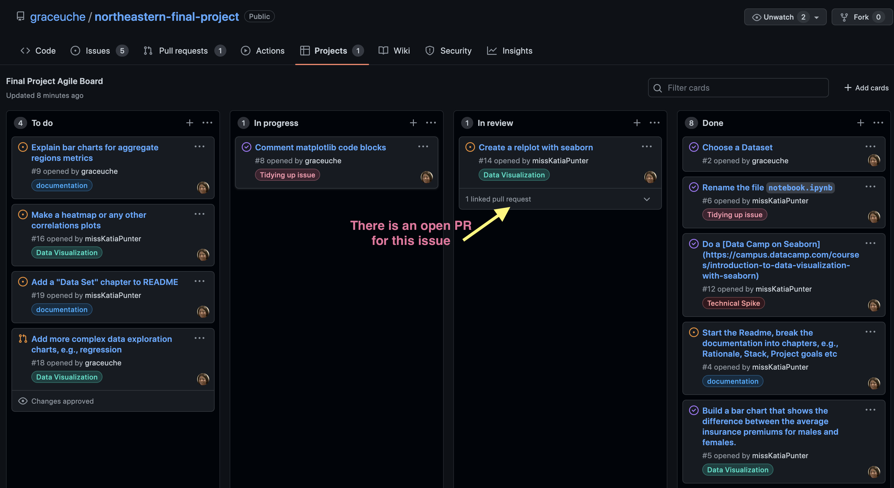

# The Final Project for Northeaster University Accelerated Data Analytics Professional Certification Program

## Project Requirements

To complete the Data Analytics course at [Norheastern Univeristy](https://www.northeastern.edu/) I had to produce the final project to fulfill the following criteria:

1. Provide the project rationale.
1. Use a dataset of a minimum of 1000 records.
1. Provide evidence of data validity (explain the source of the data)
1. Utilizing a minimum of 3 data technologies, e.g., Pandas, Plotly, Google Sheets
1. Make regular ‘commits’ on GitHub, i.e., a minimum of 2 commits per working day
1. Make Pull Requests and request code reviews
1. Use data visualization: a minimum of 5 different types of data visualization from a minimum of 2 libraries, e.g., Plotly, Seaborn, Matplotlib, Google Sheets
1. Document the project in a Readme
1. Apply Agile methodologies, such as Kanban and GitHub issues
1. Use statistical and machine learning analysis, e.g.:
      - Linear regression
      - Logistical regression
      - Clustering
      - Classification
      - Text analysis
      - Hypothesis testing
1. Comment all code blocks
1. Present the project

## Rationale 

To understand the risk in underwriting Health Insurance and how it affects
various attributes of the insured and how they affect the insurance premium.

## Data Sets

For this analysis, I have used a simulated dataset. I have found it on [Kaggle](https://www.kaggle.com/). I was looking for a beginner dataset as my experience using Python and Pandas was exactly 12 weeks, however, I also really wanted to explore healthcare or/and health insurance data.

When I came across [this dataset](https://www.kaggle.com/datasets/mirichoi0218/insurance) it was clear from the discussion on Kaggle where it came from.

It was synthesized using demographic statistics from [the U.S. Census Bureau](https://www.census.gov/). Therefore, it approximately reflects the real-world conditions but the data is not for real people, hence I could use it without worrying about privacy issues.
These data were created for a book, “Machine learning with R” by Brett Lantz, available at [Northeastern Library](https://library.northeastern.edu/). Reading the relevant chapters in the book helped me get a better idea on how medical costs are predicted.

To sum up, the data set I am using is synthetic but realistic, thus I could get a good idea of the statistical metrics in the American healthcare system and yet not risk violating any privacy laws.

## Tech Stack

For my project, I have chosen the following stack:

- [Pandas](https://pandas.pydata.org/pandas-docs/stable/)
- [Plotly](https://plotly.com/)
- [Matplotlib](https://matplotlib.org/)

## Style Guides

### Style Guides for [Seaborn](https://seaborn.pydata.org/) Visualizations

All [Seaborn](https://seaborn.pydata.org/) visualizations should have titles in titlecase, e.g.,:

```
g = sns.catplot(x='region', y='charges',
            data=insurance_premium,
            hue='sex',
            kind='point')
g.fig.suptitle('Charges vs. Region', y=1.1) 
plt.show()
```

## Team and Processes

### Team

|Name|Github|LinkedIn|
| :------: | :----------------------------------------------------------------------------------------------: | :--------------------------------------------------------------------------: |
|  Katia - **Team Lead**   | [](https://github.com/missKatiaPunter)|[](https://www.linkedin.com/in/katia-punter-6313ba177/)
|  Grace - **Data Analyst**  | [](https://github.com/graceuche) | [](https://www.linkedin.com/in/grace-uche-mba-rhia-epic-credential-trainer-677022152/)|


### Processes

The basic Kanban board from GitHub Projects was used for Project Management 👇🏼


